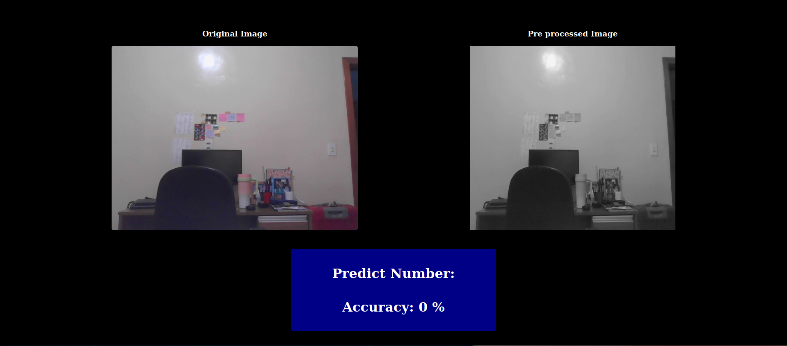

# Digit Recognition App (Frontend) / Aplicativo de Reconhecimento de Dígitos (Frontend)



## 🌐 Português

### 📖 Descrição 
Este frontend Angular conecta-se a um ***backend em Python com FastAPI*** via WebSocket para reconhecimento de dígitos manuscritos em tempo real usando a ***base de dados MNIST***. Usuários podem desenhar dígitos no canvas, e o sistema fará previsões usando um modelo de machine learning treinado com dados do MNIST.

### 🔗 Backend Integration
- **Repositório do backend**: [MNIST Handwriting Project Backend](https://github.com/gilcllys/mnist-handwriting-project-backend)

### ✨ Funcionalidades
- Comunicação em tempo real via WebSocket
- Canvas interativo com função de limpar
- Exibição de previsões e confiança do modelo
- Comparação lado a lado da imagem original e pré-processada
- Integração com dataset MNIST para reconhecimento preciso

### 🛠️ Instalação
1. Clone o repositório:
  ```bash
   git clone https://github.com/gilcllys/mnist-handwriting-project-frontend.git
```
2. Instale as dependências:
  ```bash
   npm install
```
3. Inicie a aplicação Angular:
  ```bash
    ng serve
```
4. Backend Necessário: Clone e execute o [serviço backend](https://github.com/gilcllys/mnist-handwriting-project-backend) para funcionalidade completa.

### 🧠 Arquitetura do Projeto
  ```bash
  Frontend (Angular) ↔ WebSocket ↔ Backend (Python) ↔ Modelo treinado com MNIST
```

### 🔧 Tecnologias Utilizadas

- **Frontend**: Angular 15+, RxJS, HTML5 Canvas

- **Backend**: Python, WebSocket, Machine Learning (dataset MNIST)

- **Comunicação**: Protocolo WebSocket para interação em tempo real

---
## 🌐 English

### 📖 Description
This Angular frontend application connects to a **Python backend** via WebSocket to perform real-time handwritten digit recognition using the **MNIST dataset**. Users can draw a digit on the canvas, and the system will predict it using a machine learning model trained on MNIST data.

### 🔗 Backend Integration
- **Backend Repository**: [MNIST Handwriting Project Backend](https://github.com/gilcllys/mnist-handwriting-project-backend)
- **Backend Documentation**: Complete documentation and implementation details are available in the backend repository.

### ✨ Features
- Real-time WebSocket communication
- Interactive drawing canvas with clear functionality
- Display of predictions and model confidence
- Side-by-side comparison of original and pre-processed images
- MNIST dataset integration for accurate digit recognition

### 🛠️ Installation
1. Clone the repository:
  ```bash
   git clone [your-frontend-repository-url]
```
2. Install dependencies:
  ```bash
   npm install
```
3. Start the Angular application:
  ```bash
    ng serve
```
4. Backend Required: Clone and run the [backend service](https://github.com/gilcllys/mnist-handwriting-project-backend) for full functionality.

### 🧠 Project Architecture
  ```bash
  Frontend (Angular) ↔ WebSocket ↔ Backend (Python) ↔ MNIST-trained Model
```

### 🔧 Technologies Used

- **Frontend**: Angular 15+, RxJS, HTML5 Canvas

- **Backend**: Python, WebSocket, Machine Learning (dataset MNIST)

- **Comunicação**: WebSocket protocol for real-time interaction
